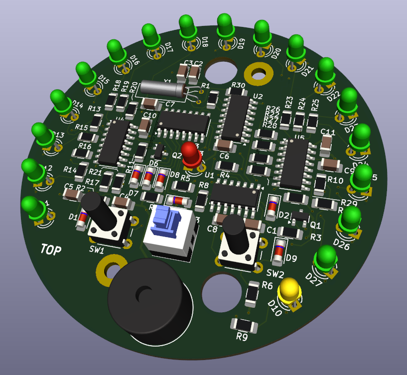

# Kitchen minute timer
This is the construction of simple kitchen minute timer based on logical 
circuits (4060, 4040, 4081 and 2x 4017). It was designed for beginners to 
train SMD components soldering (all passive components have 1206 packages).

PCB is 4-layer and was designed using KiCad 8. Fabrication output for JLCPCB is in gerber folder.

Happy soldering!

